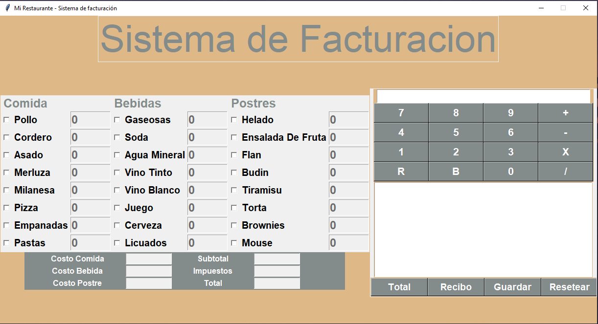

# 🍽️ Sistema de Facturación para Restaurantes

**Sistema de Facturación** es una aplicación de escritorio desarrollada en **Python** con interfaz gráfica (GUI). Diseñada para simular el entorno de punto de venta (POS) de un restaurante, permite gestionar pedidos, calcular costos automáticamente, generar recibos detallados y almacenarlos digitalmente.

Este proyecto integra lógica matemática, manipulación de archivos y diseño de interfaces interactivas.


## 📸 Captura de Pantalla


## 📋 Características Principales

El sistema ofrece un panel de control completo dividido en secciones funcionales:

* **📋 Gestión de Menú:**
    * Selección interactiva de **Comidas**, **Bebidas** y **Postres** mediante casillas de verificación.
    * Activación dinámica de campos de entrada para cantidades (UX mejorada).
* **🧮 Motor de Cálculo Automático:**
    * Suma de subtotales por categoría.
    * Cálculo automático de impuestos (7%).
    * Generación del costo total en tiempo real.
* **🧾 Generación de Recibos:**
    * Creación de tickets con número de transacción aleatorio y fecha/hora exacta.
    * Desglose detallado de ítems consumidos y costos.
* **💾 Persistencia de Datos:**
    * Funcionalidad para **guardar recibos** como archivos de texto (`.txt`) en el equipo.
* **🔢 Calculadora Integrada:**
    * Panel lateral con una calculadora funcional para operaciones rápidas sin salir de la app.

## 🛠️ Tecnologías Utilizadas

El proyecto fue construido utilizando la librería estándar de Python, lo que garantiza su portabilidad sin necesidad de instalaciones complejas:

* **`tkinter`**: Para la construcción de la Interfaz Gráfica de Usuario (ventanas, paneles, botones, entradas).
* **`random`**: Para la generación de números de recibo únicos.
* **`datetime`**: Para el registro temporal de las transacciones.
* **`filedialog`**: Para la gestión del guardado de archivos en el sistema operativo.

## ⚙️ Instalación y Ejecución

Al utilizar librerías nativas de Python, no requieres instalar paquetes externos con `pip`.

1.  **Clonar el repositorio:**
    ```bash
    git clone [https://github.com/tu-usuario/desafio_sistema_de_facturacion.git](https://github.com/tu-usuario/desafio_sistema_de_facturacion.git)
    cd desafio_sistema_de_facturacion
    ```

2.  **Ejecutar la aplicación:**
    ```bash
    python main.py
    ```

## 🚀 Guía de Uso

1.  **Seleccionar Ítems:** Marca las casillas de los productos que el cliente desea ordenar (Comida, Bebida o Postre).
2.  **Indicar Cantidad:** Al marcar una casilla, se habilitará el cuadro de texto. Ingresa la cantidad deseada (ej: 2).
3.  **Calcular:** Presiona el botón **"Total"** para procesar los costos e impuestos.
4.  **Generar Ticket:** Presiona **"Recibo"** para ver la vista previa del ticket en el panel derecho.
5.  **Guardar:** Haz clic en **"Guardar"** para exportar el ticket a un archivo `.txt`.
6.  **Limpiar:** Usa el botón **"Resetear"** para limpiar todos los campos y comenzar una nueva orden.

## 🔮 Futuras Mejoras

* Migración de los precios (actualmente en listas) a una base de datos **SQLite**.
* Implementación de un sistema de Login para diferentes camareros/cajeros.
* Exportación de recibos en formato **PDF**.

## ✒️ Autor

**Gastón Cane**
* Estudiante de Tecnicatura Superior en Ciencia de Datos e Inteligencia Artificial.
* Estudiante de Tecnicatura Superior en Desarrollo de Software.
* Instituto Politécnico Superior Córdoba.

---
*Desarrollado como desafío práctico de lógica y programación de interfaces.*
